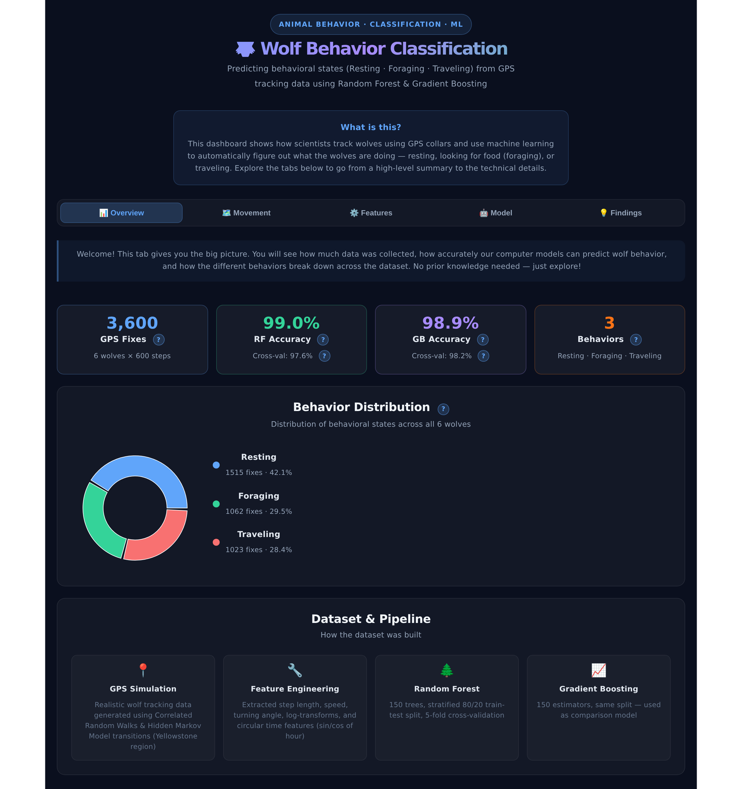
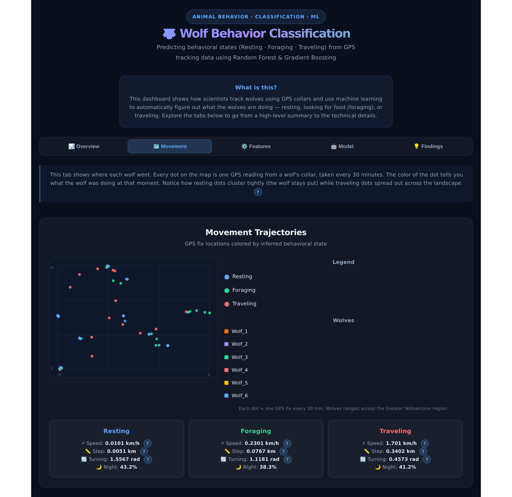
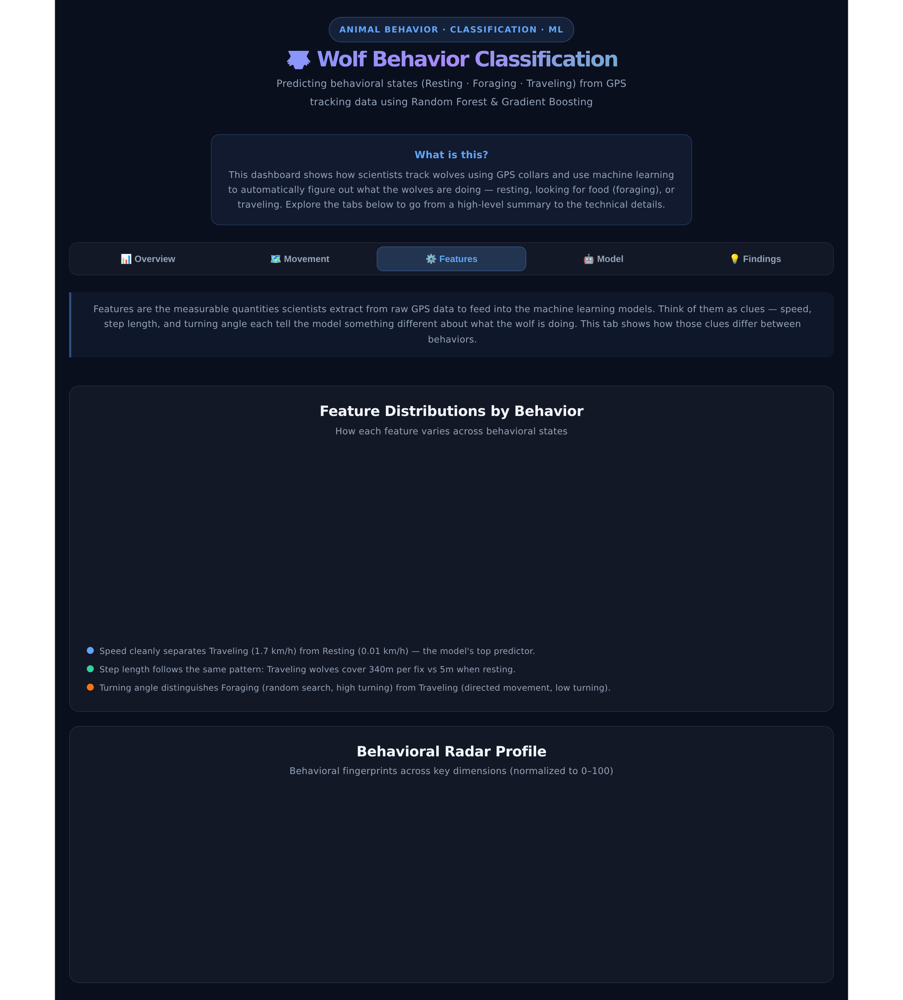
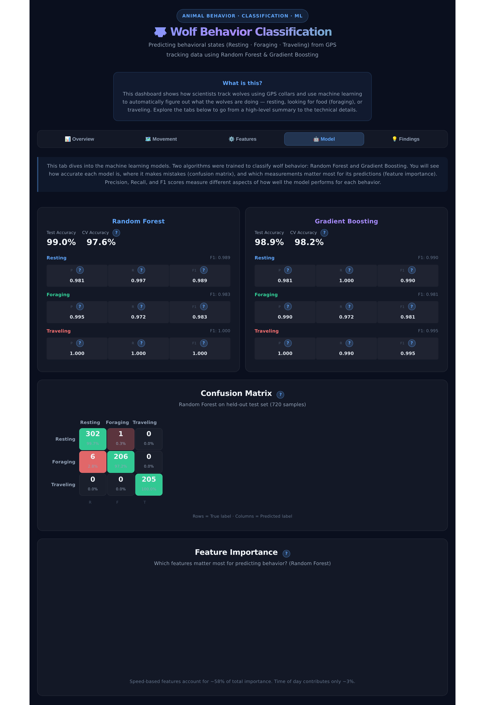
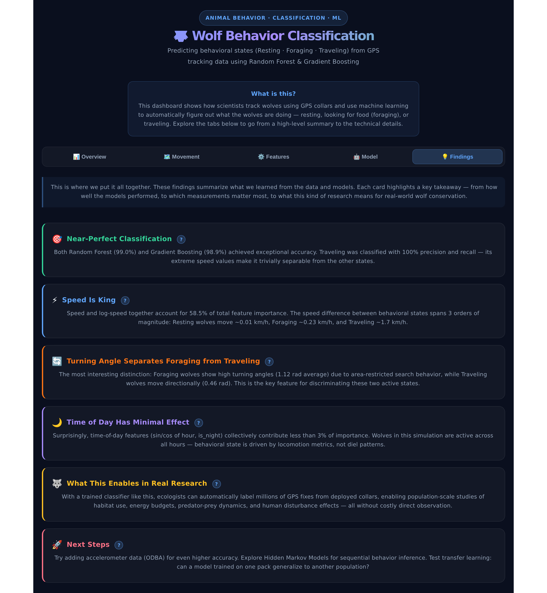

# Wolf Behavior Classification Dashboard

An interactive React dashboard that visualizes how scientists use GPS tracking data and machine learning to automatically classify wolf behavior into three states: **Resting**, **Foraging**, and **Traveling**.

Built with React + Recharts. Designed to be accessible to non-technical audiences with info tooltips and beginner-friendly explanations throughout.

## Dashboard Preview

### Overview
High-level summary of the dataset, model accuracy, and behavior distribution across 6 tracked wolves.



### Movement
GPS trajectories plotted on a map. Each dot is one GPS fix from a wolf's collar, color-coded by behavior. Resting dots cluster tightly; traveling dots spread across the landscape.



### Features
The measurable clues extracted from raw GPS data — speed, step length, and turning angle — and how they differ between behaviors. Includes a radar profile comparing behavioral fingerprints.



### Model
Performance metrics for both Random Forest and Gradient Boosting classifiers, confusion matrix, and feature importance ranking.



### Findings
Key takeaways from the analysis — from near-perfect classification accuracy to what this kind of research enables for real-world wolf conservation.



## Quick Start

```bash
cd app
npm install
npm run dev
```

Then open http://localhost:5173 in your browser.

## Tech Stack

- **React** with Vite
- **Recharts** for charts (bar, pie, radar)
- **Inline SVG** for the GPS track map
- **Puppeteer** for automated screenshots

## About the Data

The dataset simulates realistic wolf GPS tracking data using Correlated Random Walks and Hidden Markov Model transitions, set in the Greater Yellowstone region. 3,600 GPS fixes across 6 wolves, with features engineered from step length, speed, turning angle, and time-of-day signals.

Two models were trained:
- **Random Forest** — 99.0% test accuracy, 97.6% cross-validation
- **Gradient Boosting** — 98.9% test accuracy, 98.2% cross-validation
